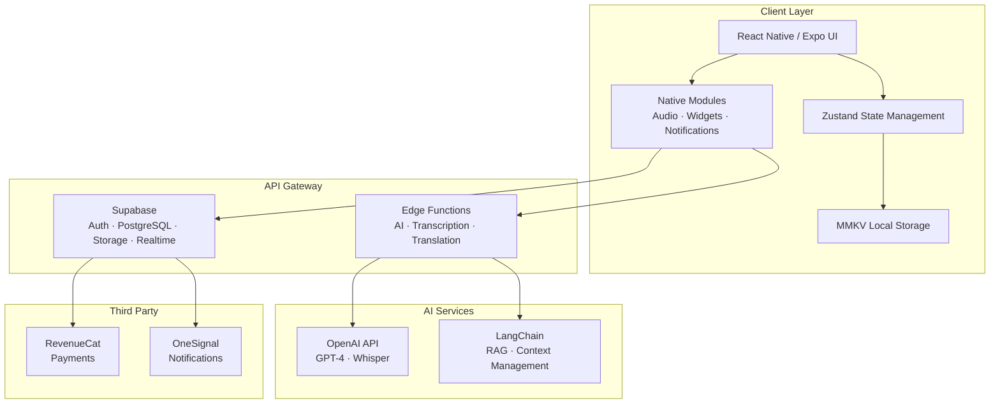
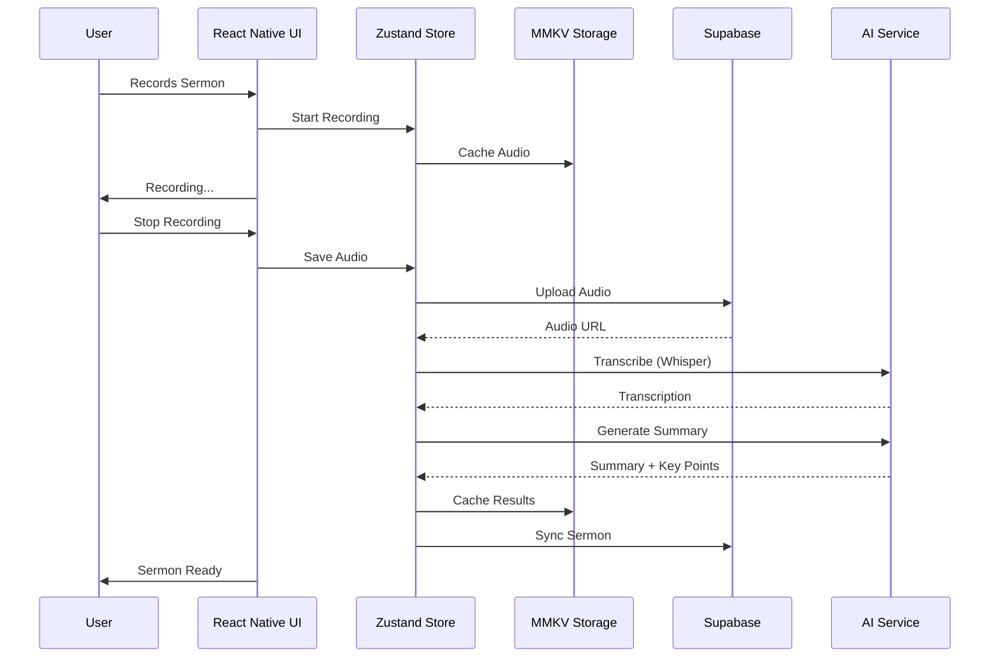
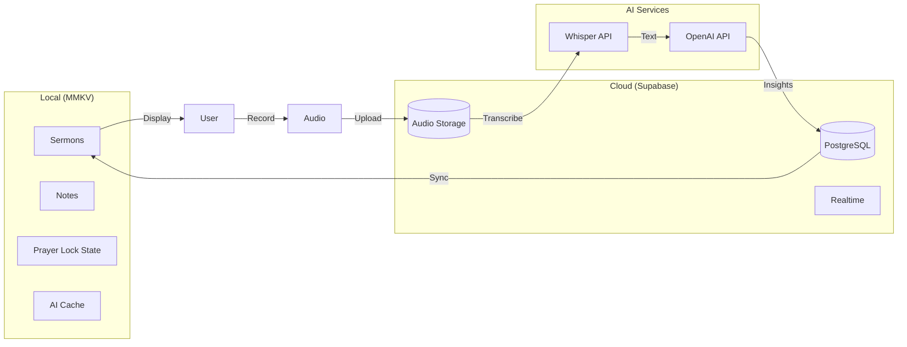
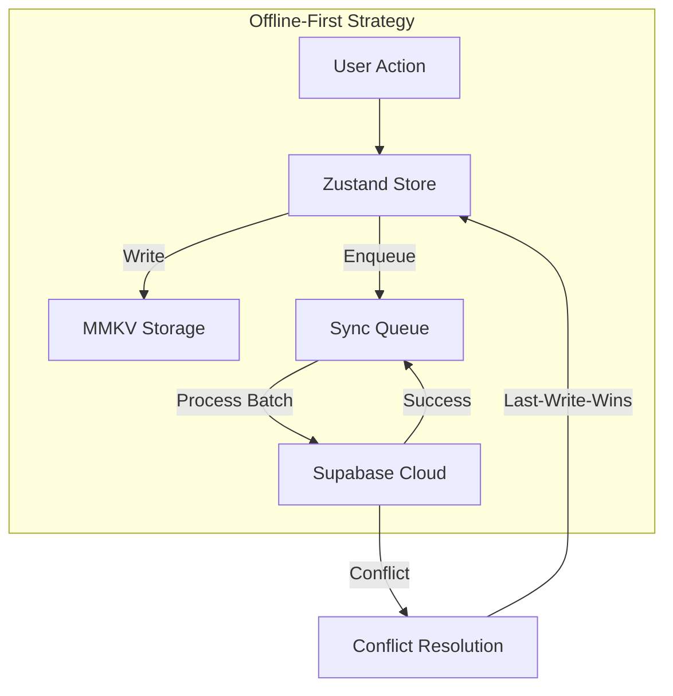
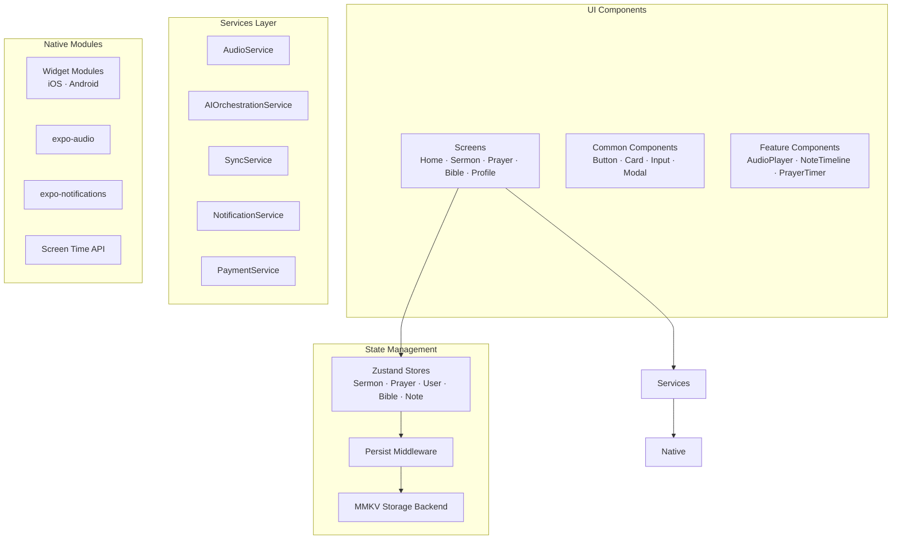

# Bible Note Taker / Prayer Lock

**An AI-Powered Faith Companion for Digital Discipleship**

[](https://reactnative.dev/)
[](https://expo.dev/)
[](https://www.typescriptlang.org/)
[](https://supabase.com/)
[](https://www.revenuecat.com/)
[](https://opensource.org/licenses/MIT)

---


## Table of Contents

- [Overview](#overview)
- [Why Bible Note Taker?](#why-bible-note-taker)
- [Key Features](#key-features)
- [Architecture](#architecture)
- [Tech Stack](#tech-stack)
- [Project Structure](#project-structure)
- [Getting Started](#getting-started)
- [Configuration](#configuration)
- [Core Services](#core-services)
- [API Reference](#api-reference)
- [Testing](#testing)
- [Deployment](#deployment)
- [Contributing](#contributing)
- [License](#license)

---

## Overview

**Bible Note Taker / Prayer Lock** is a React Native mobile application that combines AI-powered sermon note-taking with a faith-based app-blocking mechanism. Users can record sermons (audio + transcription), take timestamped notes with automatic verse detection, and voluntarily lock distracting apps until they complete a short prayer or devotion habit.

<div align="center">
<picture>
  <source media="(prefers-color-scheme: dark)" srcset="https://via.placeholder.com/800x400/1a1a2e/ffffff?text=Bible+Note+Taker+-+Dark">
  <source media="(prefers-color-scheme: light)" srcset="https://via.placeholder.com/800x400/f5f5f5/333333?text=Bible+Note+Taker+-+Light">
  
</picture>
</div>

### Core Value Proposition

| Problem | Solution |
|---------|----------|
| Sermon notes are disorganized and forgotten | Smart transcription + timestamped notes + automatic verse detection |
| Digital distractions hinder spiritual growth | Prayer Lock: block apps until a prayer/devotion is completed |
| Note-taking and prayer are disconnected | Integrated workflow: notes → prayer prompts → action items |
| Sermon insights fade over time | Flashcards, action items, and series organization |
| Spiritual habits need nurturing | AI-powered personalized insights and growth tracking |

---

## Why Bible Note Taker?

### Deepens Spiritual Habits
Connects daily note-taking and prayer requests directly to scripture using artificial intelligence. The app understands the context of your notes and suggests relevant Bible verses, helping you see how scripture speaks into your daily life.

### Minimizes Digital Distractions
The innovative "Prayer Lock" feature blocks distracting social media and news apps during timed prayer sessions or quiet time. This creates a sacred digital space for reflection and connection with God.

### Personalized Insights
Uses AI to summarize sermon notes, cross-reference Bible verses, and generate personalized prayer prompts based on past journals. The more you use the app, the more it understands your spiritual journey.

### Organized Prayer Life
Keeps track of answered prayers, ongoing requests, and spiritual growth in one secure place. Never forget a prayer request or miss a divine appointment again.

---

## Key Features

### 📝 AI Sermon & Study Notes
- **Automatic Transcription**: Record sermons and get AI-powered transcription using OpenAI Whisper
- **Timestamped Notes**: Add notes that sync with audio playback
- **Smart Verse Detection**: Automatically detects Bible references in your notes
- **AI Summarization**: Get concise summaries of sermons with key points and application
- **Rich Text Editor**: Full formatting support with headings, lists, quotes, and more

### 🔒 Smart Prayer Lock
- **App Blocking**: Locks distracting apps during prayer sessions (iOS 16+ / Android 5.0+)
- **Focus Score**: Tracks distractions and provides a focus score
- **Personalized Suggestions**: AI generates prayer topics and verses based on your journal
- **Multiple Modes**: Focused, free, guided, and intercessory prayer sessions
- **Distraction Detection**: Monitors app switching and notifications

### 📖 Scripture Matching
- **AI-Powered Matching**: Suggests relevant Bible verses based on journal entries
- **Verse of the Day**: Personalized daily verse based on your spiritual journey
- **Contextual Suggestions**: Verses matched to specific prayer requests and notes
- **Cross-Reference Engine**: Connects themes across scripture

### 🙏 Prayer Journal & Tracker
- **Prayer Requests**: Create, track, and organize prayer requests by category
- **Answered Prayers**: Log answered prayers and build a testimony journal
- **Prayer Streaks**: Track daily prayer consistency with streak tracking
- **Reminders**: Gentle reminders to pray for specific requests
- **AI-Generated Prayer Prompts**: Personalized prayer prompts based on your journal

### 🤖 AI Spiritual Advisor
- **Personalized Advice**: Encouragement, wisdom, guidance, and gentle correction
- **Growth Plans**: Create personalized 30-day spiritual growth plans
- **Daily Reflections**: AI-generated reflection prompts and questions
- **Progress Tracking**: Track your spiritual growth over time

### 📖 Bible Integration
- **Offline Bible**: Full Bible text stored locally with multiple translations
- **Reading Plans**: Through-the-Bible, New Testament in 90 days, Psalms & Proverbs
- **Interactive Maps**: Bible maps with location markers and verses
- **Immersive Reader**: Distraction-free reading with customizable settings

### 📊 Insights & Analytics
- **Spiritual Profile**: Tracks your spiritual growth journey
- **Prayer Analytics**: Visualizes prayer patterns and answered prayers
- **Sermon Knowledge Graph**: Connects themes across your sermon notes
- **Growth Metrics**: Tracks consistency and spiritual disciplines

### 💰 Monetization
- **Subscription Tiers**: Free, Pro, and Premium plans
- **Premium Content**: Exclusive devotionals, sermon series, and expert interviews
- **Loyalty Program**: Earn points through spiritual activities
- **Referral Program**: Invite friends and earn rewards
- **Gift Cards**: Give the gift of spiritual growth

### 🌍 Multi-Lingual Support
- **15+ Languages**: English, Spanish, French, Portuguese, Chinese, Arabic, and more
- **Offline Translation**: Download translation models for offline use
- **Translation Memory**: Learns from user corrections
- **Cultural Adaptation**: Content adapted for cultural context

### 📱 Platform Features
- **Lock Screen Widgets**: iOS Live Activities & Android AppWidgets
- **Dynamic Island**: Real-time prayer timer on iOS
- **Push Notifications**: Daily verses, prayer reminders, and streak notifications
- **Deep Linking**: Share sermon notes and verses via deep links
- **Offline-First**: Works without internet, syncs when online

---

## Architecture

### High-Level Architecture



### Application Flow Diagram



### Data Flow Diagram



### Offline-First Architecture



### Component Architecture



---

## Tech Stack

### Framework & Core

| Technology | Version | Purpose |
|------------|---------|---------|
| **React Native** | 0.85+ | Cross-platform mobile framework |
| **Expo SDK** | 56+ | Development platform and tools |
| **TypeScript** | 5.3+ | Type-safe JavaScript |
| **Expo Router** | 4.0+ | File-based navigation |

### State Management & Storage

| Technology | Version | Purpose |
|------------|---------|---------|
| **Zustand** | 5.0+ | State management |
| **MMKV** | 3.2+ | High-performance local storage (30-100x faster than AsyncStorage) |
| **Supabase** | 2.49+ | Backend (Auth, PostgreSQL, Storage, Realtime) |

### AI & Machine Learning

| Technology | Version | Purpose |
|------------|---------|---------|
| **OpenAI API** | GPT-4o / Whisper | Transcription, summarization, verse detection |
| **LangChain** | 0.3+ | RAG and context management |
| **Expo AI** | Various | On-device AI capabilities |

### Payments & Analytics

| Technology | Version | Purpose |
|------------|---------|---------|
| **RevenueCat** | 8.0+ | Subscription management |
| **OneSignal** | 5.0+ | Push notifications |
| **Expo Updates** | Latest | OTA updates |

### Platform-Specific

| Technology | Version | Purpose |
|------------|---------|---------|
| **FamilyControls** | iOS 16+ | App blocking on iOS |
| **UsageStatsManager** | Android 5.0+ | App blocking on Android |
| **ActivityKit** | iOS 16.1+ | Live Activities & Dynamic Island |
| **AppWidget** | Android 5.0+ | Lock screen widgets |

---

## Project Structure

```
bible-note-taker/
├── app/                          # Expo Router (file-based routing)
│   ├── (auth)/
│   │   ├── login.tsx
│   │   ├── signup.tsx
│   │   └── reset-password.tsx
│   ├── (tabs)/
│   │   ├── _layout.tsx
│   │   ├── index.tsx           # Home
│   │   ├── sermons.tsx         # Sermon list
│   │   ├── prayer.tsx          # Prayer lock
│   │   └── profile.tsx
│   ├── sermon/
│   │   └── [id].tsx            # Sermon detail
│   ├── prayer-lock/
│   │   └── index.tsx
│   ├── ai-companion/
│   │   └── index.tsx
│   └── _layout.tsx
├── assets/
│   ├── fonts/
│   ├── images/
│   └── animations/
├── components/
│   ├── common/
│   │   ├── Button.tsx
│   │   ├── Input.tsx
│   │   ├── Card.tsx
│   │   └── LoadingSpinner.tsx
│   ├── sermon/
│   │   ├── AudioPlayer.tsx
│   │   ├── NoteTimeline.tsx
│   │   ├── NoteInput.tsx
│   │   ├── TranscriptionView.tsx
│   │   └── VerseDetector.tsx
│   ├── prayer/
│   │   ├── PrayerLockScreen.tsx
│   │   ├── GuidedPrayer.tsx
│   │   ├── GratitudeJournal.tsx
│   │   └── ScriptureReflection.tsx
│   └── ai/
│       ├── AICompanionChat.tsx
│       ├── SermonSummary.tsx
│       └── FlashcardDeck.tsx
├── services/
│   ├── AudioService.ts
│   ├── TranscriptionService.ts
│   ├── PrayerLock.ts
│   ├── PrayerLock.iOS.ts
│   ├── PrayerLock.Android.ts
│   ├── AIService.ts
│   ├── AIOrchestrationService.ts
│   ├── SyncService.ts
│   ├── Payments.ts
│   └── NotificationService.ts
├── stores/
│   ├── sermonStore.ts
│   ├── prayerStore.ts
│   ├── userStore.ts
│   └── syncStore.ts
├── lib/
│   ├── supabase.ts
│   ├── storageKeys.ts
│   ├── secureStorage.ts
│   └── performance.ts
├── hooks/
│   ├── useSermon.ts
│   ├── usePrayerLock.ts
│   ├── useOfflineSync.ts
│   └── useSubscription.ts
├── types/
│   ├── sermon.ts
│   ├── prayer.ts
│   └── user.ts
├── theme/
│   ├── colors.ts
│   ├── typography.ts
│   └── spacing.ts
├── utils/
│   ├── bibleVerses.ts
│   ├── dateHelpers.ts
│   └── validation.ts
├── ios/                            # iOS native code
│   ├── Widgets/
│   │   ├── PrayerLockWidget.swift
│   │   ├── SermonVerseWidget.swift
│   │   └── PrayerStreakWidget.swift
│   └── LiveActivities/
│       ├── PrayerLockActivity.swift
│       └── SermonNoteActivity.swift
├── android/                        # Android native code
│   └── app/src/main/java/
│       └── com/biblenotetaker/
│           └── widget/
│               └── PrayerLockWidget.kt
├── supabase/
│   └── functions/                  # Edge Functions
│       ├── ai-summarize/
│       ├── ai-action-items/
│       ├── ai-companion/
│       ├── transcribe/
│       ├── translate-text/
│       └── generate-prayer/
├── __tests__/
│   ├── unit/
│   ├── integration/
│   └── __mocks__/
├── app.json
├── eas.json
├── package.json
├── tsconfig.json
└── README.md
```

---

## Getting Started

### Prerequisites

- Node.js 20+
- npm or yarn
- Expo CLI
- iOS: Xcode 14+ (for iOS development)
- Android: Android Studio (for Android development)

### Installation

```bash
# Clone the repository
git clone https://github.com/yourusername/bible-note-taker.git
cd bible-note-taker

# Install dependencies
yarn install
# or
npm install

# Install iOS dependencies (macOS only)
cd ios && pod install && cd ..

# Start the development server
npx expo start
```

### Running the App

```bash
# iOS
npx expo run:ios

# Android
npx expo run:android

# Web (optional)
npx expo start --web
```

### Environment Setup

Create a `.env` file in the root directory:

```env
EXPO_PUBLIC_SUPABASE_URL=your_supabase_url
EXPO_PUBLIC_SUPABASE_ANON_KEY=your_supabase_anon_key
EXPO_PUBLIC_OPENAI_API_KEY=your_openai_key
EXPO_PUBLIC_ONESIGNAL_APP_ID=your_onesignal_id
EXPO_PUBLIC_REVENUECAT_API_KEY=your_revenuecat_key

# iOS App Store (for EAS Build)
EAS_SECRET_APPLE_ID=your_apple_id
EAS_SECRET_APPLE_APP_SPECIFIC_PASSWORD=your_password
EAS_SECRET_ANDROID_SERVICE_ACCOUNT_KEY=your_service_account_json
```

---

## Configuration

### Supabase Setup

1. Create a Supabase project
2. Run the migration scripts in `/supabase/migrations`
3. Set up Row Level Security (RLS) policies
4. Configure storage buckets for audio files

### RevenueCat Setup

1. Create a RevenueCat project
2. Configure products in RevenueCat dashboard
3. Add entitlements: `pro`, `premium`
4. Link App Store Connect and Google Play Console

### iOS Setup

1. Enable Family Controls entitlement in Apple Developer
2. Configure App Groups for widget data sharing
3. Set up Live Activities in Xcode
4. Request Family Controls approval from Apple

### Android Setup

1. Enable Usage Stats permission
2. Configure AppWidget provider
3. Set up foreground service for audio recording
4. Request Accessibility permission

---

## Core Services

### AI Orchestration Service

The `AIOrchestrationService` manages all AI requests with caching, prioritization, and usage tracking.

```typescript
// Example: Process an AI request
const response = await AI.processRequest({
  capability: 'summarization',
  input: { text: 'Sermon transcription...' },
  priority: 'high',
});
```

### Prayer Lock Service

The `PrayerLock` service handles platform-specific app blocking.

```typescript
// Example: Activate prayer lock
await PrayerLock.activateLock(['com.instagram', 'com.facebook'], {
  type: 'prayer',
  prompt: 'Complete your prayer to unlock apps',
  duration: 300,
});
```

### Sync Service

The `SyncService` manages offline-first synchronization.

```typescript
// Example: Sync data
await SyncService.syncSermon(sermonId);
await SyncService.fullSync(userId);
```

### Notification Service

The `NotificationService` handles push and local notifications.

```typescript
// Example: Schedule daily verse notification
await Notify.scheduleDailyVerse(8, 0); // 8:00 AM
```

---

## API Reference

### REST API (Supabase)

| Endpoint | Method | Purpose |
|----------|--------|---------|
| `/auth/*` | Various | Authentication |
| `/rest/v1/sermons` | GET/POST/PUT/DELETE | Sermon CRUD |
| `/rest/v1/notes` | GET/POST/PUT/DELETE | Note CRUD |
| `/rest/v1/prayer_sessions` | GET/POST | Prayer sessions |
| `/rest/v1/profiles` | GET/PUT | User profiles |

### Edge Functions

| Function | Method | Purpose |
|----------|--------|---------|
| `/functions/v1/ai-summarize` | POST | AI sermon summary |
| `/functions/v1/ai-action-items` | POST | Extract action items |
| `/functions/v1/ai-companion` | POST | AI chat companion |
| `/functions/v1/transcribe` | POST | Whisper transcription |
| `/functions/v1/translate-text` | POST | AI translation |
| `/functions/v1/generate-prayer` | POST | Prayer generation |

---

## Testing

### Unit Tests (Jest)

```bash
yarn test
```

### Integration Tests

```bash
yarn test:integration
```

### E2E Tests (Maestro)

```bash
yarn test:e2e
```

### Test Coverage

```bash
yarn test:coverage
```

---

## Deployment

### EAS Build

```bash
# Development build
eas build --platform ios --profile development
eas build --platform android --profile development

# Production build
eas build --platform ios --profile production
eas build --platform android --profile production
```

### App Store Submission

```bash
eas submit --platform ios
```

### Play Store Submission

```bash
eas submit --platform android
```

### OTA Updates

```bash
eas update --branch production --message "Update description"
```

---

## Contributing

We welcome contributions! Please see our [Contributing Guide](CONTRIBUTING.md).

### Development Workflow

1. Fork the repository
2. Create a feature branch
3. Make your changes
4. Run tests
5. Submit a pull request

### Code Style

- TypeScript with strict mode
- ESLint and Prettier for formatting
- Conventional commits

### Pull Request Requirements

- Tests pass
- Code coverage maintained
- Documentation updated
- No breaking changes without discussion

---

## License

This project is licensed under the MIT License - see the [LICENSE](LICENSE) file for details.

---

## Acknowledgments

- [React Native](https://reactnative.dev/) - Cross-platform framework
- [Expo](https://expo.dev/) - Development platform
- [Supabase](https://supabase.com/) - Backend as a Service
- [OpenAI](https://openai.com/) - AI capabilities
- [RevenueCat](https://www.revenuecat.com/) - Subscription management
- [All Contributors](https://github.com/yourusername/bible-note-taker/graphs/contributors)

---

## Support

- 📧 Email: support@biblenotetaker.com
- 🐛 Issues: [GitHub Issues](https://github.com/yourusername/bible-note-taker/issues)
- 💬 Discord: [Join our community](https://discord.gg/biblenotetaker)
- 📚 Documentation: [docs.biblenotetaker.com](https://docs.biblenotetaker.com)

---

<div align="center">
  <sub>Built with ❤️ for spiritual growth</sub>
</div>
